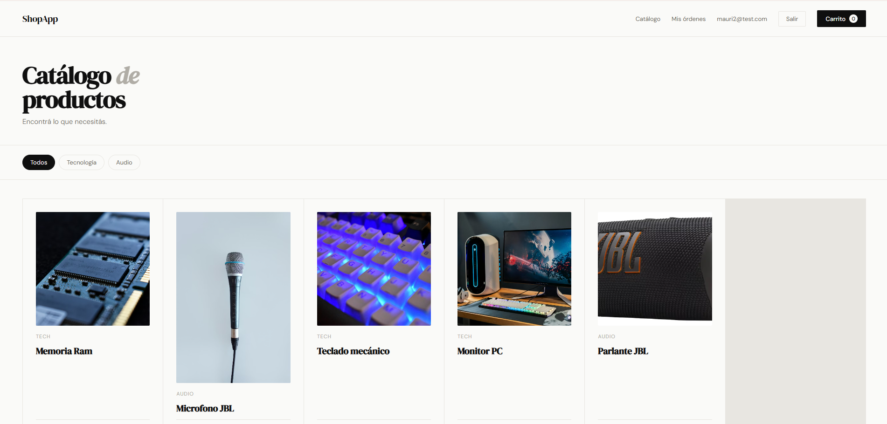
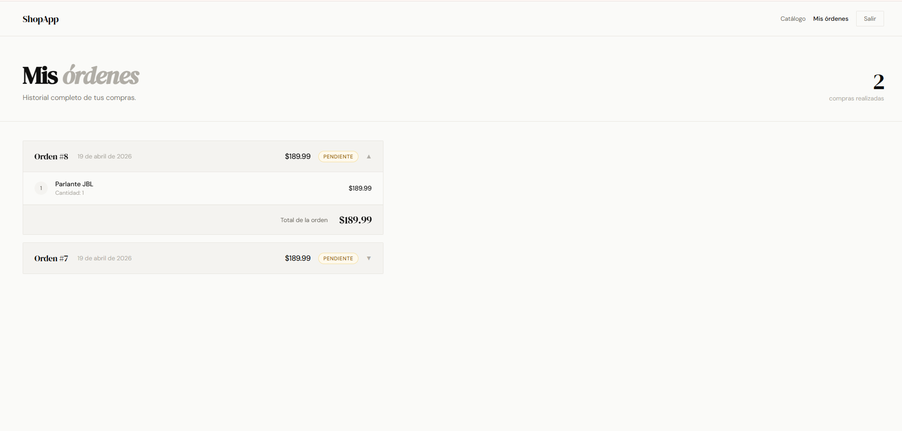

ShopApp
E-commerce fullstack construido desde cero con Node.js, Express y PostgreSQL. Incluye autenticación JWT, carrito de compras, gestión de stock y historial de órdenes deployado en producción.
🔗 Ver demo en vivo

El servidor puede tardar ~1 minuto en despertar si estuvo inactivo (plan gratuito de Render).

Capturas
Catálogo de productos

Historial de órdenes

Stack tecnológico
CapaTecnologíaFrontendHTML5, CSS3, JavaScript vanillaBackendNode.js, ExpressBase de datosPostgreSQL (producción), SQLite (desarrollo)AutenticaciónJWT + bcryptDeployRenderControl de versionesGit + GitHub

Funcionalidades

Registro y login de usuarios con contraseñas hasheadas (bcrypt)
Sesión persistente con tokens JWT (expiración en 7 días)
Catálogo de productos con filtros por categoría
Carrito lateral con control de cantidades
Creación de órdenes con validación de stock en tiempo real
Descuento automático de stock al confirmar compra
Historial de órdenes con detalle expandible por orden
Protección de rutas privadas mediante middleware JWT
Compatibilidad dual SQLite/PostgreSQL según entorno

Arquitectura
shopapp/
├── backend/
│   ├── db/
│   │   ├── database.js      # Conexión dual SQLite/PostgreSQL
│   │   └── seed.js          # Datos iniciales
│   ├── middleware/
│   │   └── auth.js          # Verificación JWT
│   ├── routes/
│   │   ├── auth.js          # POST /register, POST /login
│   │   ├── products.js      # GET/POST/PATCH /products
│   │   └── orders.js        # POST /orders, GET /orders/me
│   └── server.js
└── frontend/
    ├── index.html           # Catálogo
    ├── login.html           # Login / Registro
    ├── orders.html          # Historial de órdenes
    └── js/
        ├── app.js           # Lógica del catálogo
        ├── auth.js          # Login, registro, authFetch
        └── cart.js          # Carrito y checkout

API Reference
MétodoEndpointAuthDescripciónPOST/api/auth/registerNoCrear cuentaPOST/api/auth/loginNoIniciar sesiónGET/api/productsNoListar productosPOST/api/productsNoCrear productoPATCH/api/products/:idNoActualizar productoPOST/api/ordersJWTCrear ordenGET/api/orders/meJWTHistorial del usuario

Correr localmente
bash# Clonar el repositorio
git clone https://github.com/MauricioPusiol/shopapp.git
cd shopapp/backend

# Instalar dependencias
npm install

# Crear archivo .env
echo "PORT=3000" > .env
echo "JWT_SECRET=tu_clave_secreta" >> .env

# Cargar datos iniciales
node db/seed.js

# Iniciar el servidor
node server.js
Abrí http://localhost:3000 en el navegador.

Usuario demo
Para probar la app sin registrarse:
CampoValorEmaildemo@shopapp.comPassworddemo123

Lo que aprendí

Diseño de APIs RESTful con separación de rutas y middlewares
Autenticación stateless con JWT y hashing de contraseñas con bcrypt
Diferencias entre SQLite y PostgreSQL y cómo abstraerlas
Transacciones SQL para mantener consistencia de datos
Deploy de aplicaciones Node.js en producción con variables de entorno
Debugging de errores en producción a través de logs

Próximos pasos

 Migrar frontend a React
 Panel de administración para gestionar productos
 Integración con pasarela de pagos (MercadoPago)
 Roles de usuario (admin / cliente)
 Tests con Jest

Desarrollado por Mauricio Pusiol — GitHub